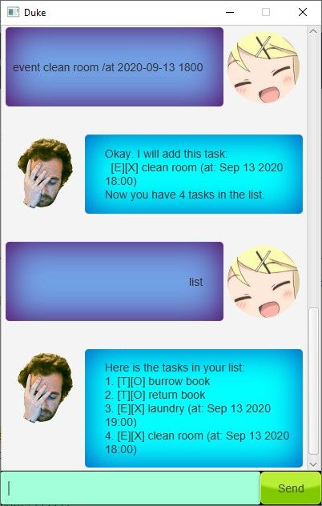

# Duke User Guide
Duke is a **desktop app to manage your tasks** via a chatbot-like interface. By being able to view
and manage your tasks easily, you will be able to increase your productivity in your daily life.



## Table of Content

- [Features](#features)
- [Usage](#usage)
    - [todo](#todo-description---adding-todo-task)
    - [deadline](#deadline-description-at-date-time---adding-deadline-task)
    - [event](#event-description-at-date-time---adding-event-task)
    - [list](#list---listing-all-the-tasks)
    - [done](#done-index---marking-a-task-as-done)
    - [delete](#delete-index---deleting-a-task)
    - [find](#find-keyword---finding-tasks-by-keyword)
    - [reschedule](#reschedule-index-date-time---changing-a-tasks-date-and-time)
    - [taskafter](#taskafter-date---listing-all-the-tasks-after-a-date)
    - [taskbefore](#taskbefore-date---listing-all-the-tasks-before-a-date)
    - [bye](#bye---exiting-the-app)
## Features 

### Support multiple type of tasks
Duke classifies tasks as todo, deadline, or event, where deadline and event has a date associated with them. This give you freedom to
group your tasks accordingly.

### Mark task as done
You can mark a task that you have finished as done.

### Delete task
You can delete a task that you have already finished in order to clean up your list.

### Find task with keyword
You can find all the tasks that contains a certain keyword you query.

### View all your tasks
You can view all your current tasks and its status as well as its date for deadline and event task.

### Reschedule your tasks
You are able to reschedule your tasks. Note that you can o

### View tasks before or after a certain date
You are able to list out all the tasks after or before a certain date you query. 

### Auto-save
Duke will save all your tasks automatically in your computer.

## Usage

### `todo <description>` - Adding todo task

Adds a todo task to the list.

Example of usage: 

`todo burrow book`

Expected outcome:

```
Okay. I will add this task:
  [T][X] burrow book
Now you have 4 tasks in the list.
```

*** 

### `deadline <description> /at <date> <time>` - Adding deadline task

Adds a deadline task with specified date and time to the list.

Example of usage: 

`deadline homework /by 2020-09-13 2000`

Expected outcome:

```
Okay. I will add this task:
  [D][X] homework (by: Sep 13 2020 20:00)
Now you have 5 tasks in the list.
```

*** 

### `event <description> /at <date> <time>` - Adding event task

Adds an event task with the specified date and time to the list.

Example of usage: 

`event project meeting /at 2020-09-13 2200`

Expected outcome:

```
Okay. I will add this task:
  [E][X] project meeting (at: Sep 13 2020 22:00)
Now you have 6 tasks in the list.
```

***

### `list` - Listing all the tasks

Shows a list of all the tasks and their status in the Duke.

Example of usage: 

`list`

Expected outcome:

```
Here is the tasks in your list:
1. [T][O] return book
2. [E][X] laundry (at: Sep 13 2020 19:00)
3. [E][X] clean room (at: Sep 13 2020 18:00)
4. [T][X] burrow book
5. [D][X] homework (by: Sep 13 2020 20:00)
6. [E][X] project meeting (at: Sep 13 2020 22:00)
```

***

### `done <index>` - Marking a task as done

Marks the task at the specified index as done. 
The task's index follows the numbering from the 'list' command. 


Note that index must be a **positive integer**.

Example of usage: 

`done 5`

Expected outcome:

```
Successfully marked this task as done:
  [D][O] homework (by: Sep 13 2020 20:00)
```

***

### `delete <index>` - Deleting a task

Delete the task on the specified index.
The task's index follows the numbering from the 'list' command.


Note that index has to be **postive integer**.

Example of usage: 

`delete 4`

Expected outcome:

```
Okay. I will delete this task:
  [T][X] burrow book
Now you have 5 tasks in the list.
```

***

### `find <keyword>` - Finding tasks by keyword

Finds all the tasks which description contains the keyword.

Example of usage:

`find room`

Expected outcome:

```
Here are the matching tasks in your list:
1. [E][X] clean room (at: Sep 13 2020 18:00)
2. [T][X] check room
```

***

### `reschedule <index> <date> <time>` - Changing a task's date and time

Reschedules the task on the index to the specified date and time.
The task's index follows the numbering from the 'list' command.


Note that the task **can't be todo** since todo task does not have date
 and index has to be **positive integer**.

Example of usage:

`reschedule 2 2020-09-20 2000`

Expected outcome:

```
Successfully change this task's date:
  [E][X] laundry (at: Sep 20 2020 20:00)
```

***

### `taskafter <date>` - Listing all the tasks after a date

Shows all the task after the specified date.

Example of usage:

`taskafter 2020-09-15`

Expected outcome:

```
Here is the tasks after Sep 15 2020:
1. [E][X] laundry (at: Sep 20 2020 20:00)
```

***

### `taskbefore <date>` - Listing all the tasks before a date

Shows all the task before or equal to the specified date.

Example of usage:

`taskbefore 2020-09-13`

Expected outcome:

```
Here is the tasks before Sep 13 2020:
1. [E][X] clean room (at: Sep 11 2020 18:00)
2. [D][O] homework (by: Sep 13 2020 20:00)
3. [E][X] project meeting (at: Sep 13 2020 22:00)
```

***

### `bye` - Exiting the app

Exits the app.

Example of usage:

`bye`

Expected outcome:\
Duke app terminated.